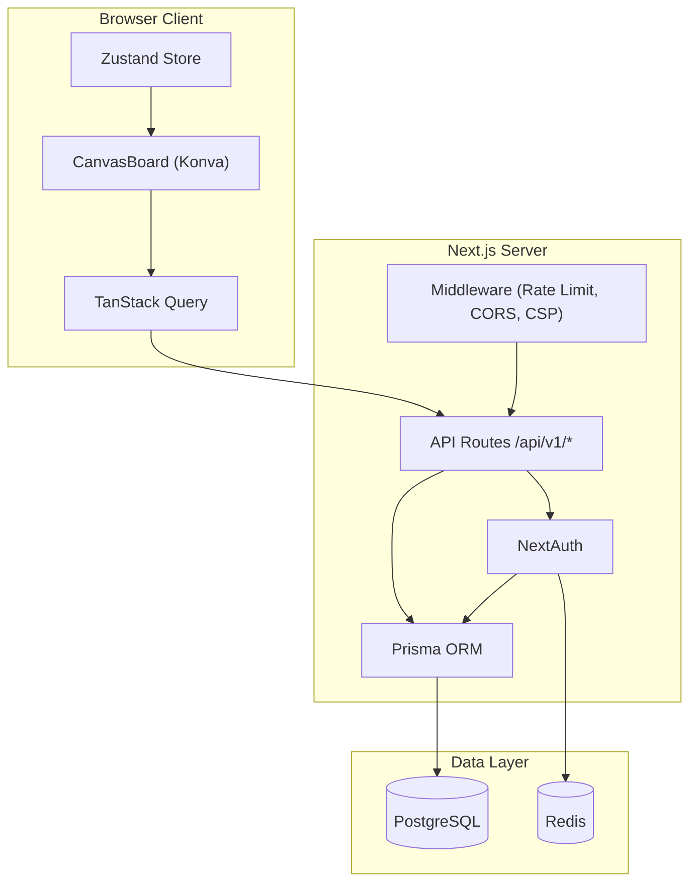

# OPUS.md - Comprehensive Codebase Review

**Project:** Memoria (CanvasCollect)  
**Date:** December 11, 2025  
**Reviewer:** Automated Code Review System

---

## 1. System Overview

### Project Type
A real-time collaborative canvas application for creating notes, bookmarks, and visual content.

### Tech Stack
| Layer | Technology | Version |
|-------|------------|---------|
| Frontend | Next.js + React | 15.0.3 / 19.0.0 |
| State (Server) | TanStack Query | 5.62.7 |
| State (UI) | Zustand | 5.0.2 |
| Database | PostgreSQL + Prisma | 6.1.0 |
| Auth | NextAuth (beta) | 5.0.0-beta.25 |
| Canvas | Konva + react-konva | 9.3.18 |
| Caching | Redis (ioredis) | 5.8.2 |
| Real-time | Yjs + y-websocket | 13.6.27 |
| Monitoring | Sentry | 10.29.0 |

### Architecture Diagram



### Key Modules

| Module | Location | Purpose |
|--------|----------|---------|
| Canvas | `src/features/canvas/` | Core canvas functionality (46 components) |
| Auth | `src/features/auth/` | Login, register, password reset |
| API | `src/app/api/v1/` | REST endpoints (15 route groups) |
| Hooks | `src/lib/hooks/` | 25 reusable React hooks |
| Services | `src/lib/services/` | Analytics, notifications, search, templates |
| Stores | `src/stores/` | Zustand UI state management |

---

## 2. Architectural Review

### ✅ Strengths

1. **Clean separation of concerns**: Server state (TanStack Query) vs UI state (Zustand)
2. **Comprehensive middleware**: Rate limiting, CORS, CSP, security headers
3. **RFC 7807 error handling**: Standardized problem details format
4. **Constants extraction**: Magic numbers centralized in `constants.ts`
5. **Database resilience**: Retry logic with exponential backoff in `db.ts`
6. **Proper logging**: Pino logger with request tracing

### ⚠️ Issues

#### 2.1 God Component: `CanvasBoard.tsx`

| Metric | Value | Threshold |
|--------|-------|-----------|
| Lines | 1,434 | <400 |
| Functions | 45+ | <20 |
| State Variables | 35+ | <15 |

**File:** [CanvasBoard.tsx](file:///c:/Users/V/notes-1/src/features/canvas/components/CanvasBoard.tsx)

**Handles:** Canvas rendering, 35+ state vars, keyboard shortcuts, mouse events, drawing, collaboration, CRUD, 13 dialogs, context menu, selection, versioning, AI, export, AR, Whisper, templates

**Recommendation:**
```
CanvasBoard.tsx           → ~200 lines (orchestrator)
hooks/use-canvas-keyboard.ts
hooks/use-canvas-selection.ts  
hooks/use-canvas-dialogs.ts
components/CanvasStage.tsx
components/CanvasDialogs.tsx
```

**Priority:** Medium | **Effort:** High

---

#### 2.2 Three Parallel Error Patterns

**Current state:** Three different error handling patterns coexist:

| Pattern | Example | Location |
|---------|---------|----------|
| Class-based | `throw new NotFoundError()` | `errors.ts` |
| Factory | `throw notFoundError('Canvas', id)` | Various |
| Problems | `return Problems.NotFound()` | Older code |

**File:** [errors.ts](file:///c:/Users/V/notes-1/src/lib/errors.ts)

**Recommendation:** Standardize on class-based errors from `errors.ts`

**Priority:** Low | **Effort:** Medium

---

#### 2.3 Beta Dependencies in Production

| Dependency | Version | Risk |
|------------|---------|------|
| `next-auth` | 5.0.0-beta.25 | ⚠️ Beta in production |
| `react` | 19.0.0 | Recently stable |
| `next` | 15.0.3 | Recently stable |

**Action:** Monitor NextAuth for stable release, plan upgrade

---

## 3. Code Quality & Smells

### 3.1 Type Safety Issues

#### `as any` Casts (17 files)

| File | Concern |
|------|---------|
| `route-handler.ts` | API handler generics |
| `CanvasBoard.tsx` | Konva event types |
| `websocket-server.ts` | WebSocket message types |
| `Canvas.tsx` | Konva ref types |
| `ARCanvasLayer.tsx` | AR Kit types |

#### `@ts-ignore` Comments (4 files)

| File | Reason |
|------|--------|
| `password.ts` | zxcvbn import |
| `export-utils.ts` | jsPDF typing |
| `CanvasBoard.tsx` (3×) | Konva type gaps |

**Recommendation:** Create proper TypeScript declarations or use more specific casts

---

### 3.2 React Rendering Concerns

| Issue | Location | Impact |
|-------|----------|--------|
| `useCanvasStore.getState()` in render | CanvasBoard:989 | Bypasses React updates |
| Inline arrow functions | Throughout | Re-renders |
| Timeout cleanup | CanvasBoard:177 | Potential memory leak |

**File:** [CanvasBoard.tsx#L177](file:///c:/Users/V/notes-1/src/features/canvas/components/CanvasBoard.tsx#L177)

---

### 3.3 Console Usage

Only 2 files with `console.log`:
- `src/lib/email/providers/console.ts` - ✅ Intentional (dev email provider)
- `src/types/canvas.ts` - ⚠️ Should use logger

---

## 4. Logic & UX/Flow Issues

### 4.1 Missing Error Boundaries

The canvas lacks an error boundary for crash recovery. If any canvas component throws during render, the entire page crashes.

**Recommendation:** Add `<ErrorBoundary>` wrapper around canvas components

**File to create:** `src/features/canvas/components/CanvasErrorBoundary.tsx`

---

### 4.2 Real-time Collaboration

**Current:** Polling-based (5s active, 30s inactive)  
**Limitation:** Not true real-time, may miss rapid updates

The WebSocket infrastructure exists (`y-websocket`, `yjs`) but polling is the default for shared canvases.

**File:** [use-canvas-items.ts](file:///c:/Users/V/notes-1/src/lib/hooks/use-canvas-items.ts)

---

## 5. Missing UI Components & Pages

### 5.1 Missing Pages

| Expected Page | Status | Notes |
|---------------|--------|-------|
| `/profile` | ❌ Missing | No dedicated profile page (merged into Settings) |
| `/api-keys` | ❌ Missing | Users cannot manage their API keys |
| `/workspaces` | ❌ Missing | Prisma model exists but no UI |
| `/notifications` | ❌ Missing | No notifications center |
| `/help` or `/docs` | ❌ Missing | No in-app help/documentation |

### 5.2 Missing UI States

| Component | Loading | Error | Empty | Notes |
|-----------|---------|-------|-------|-------|
| Dashboard | ✅ Skeleton | ⚠️ Basic | ✅ Yes | Error shows Alert but no retry |
| Canvas | ✅ Spinner | ✅ With retry | N/A | Well implemented |
| Comments | ✅ Skeleton | ⚠️ Basic | ✅ Yes | No retry button on error |
| Versions | ✅ Skeleton | ⚠️ Basic | ✅ Yes | No retry button on error |
| Templates | ✅ Skeleton | ✅ Alert | ✅ Yes | Good |
| Settings | ⚠️ None | ✅ Snackbar | N/A | No initial loading state |

### 5.3 Missing Settings/Features in UI

| Feature | API Exists | UI Exists | Notes |
|---------|------------|-----------|-------|
| Change Email | ❌ No | ❌ No | Email shown as read-only in settings |
| Profile Picture Upload | ❌ No | ❌ No | Avatar uses initials only |
| Email Notifications | ❌ No | ❌ No | No notification preferences |
| Export All Data | ❌ No | ❌ No | No GDPR data export |
| 2FA/MFA | ❌ No | ❌ No | No two-factor authentication |
| Session Management | ❌ No | ❌ No | Users cannot see/revoke sessions |

### 5.4 Incomplete UI Flows

| Flow | Issue |
|------|-------|
| Email Verification | API exists but no UI indicator for unverified emails |
| Password Reset | Flow exists but no "check your email" confirmation page |
| Shared Canvas Access | No "pending invitations" view for invited users |
| Template Publishing | Can save as template but no moderation/review flow |

---

## 6. Performance & Optimization

### 6.1 Good Practices

- ✅ Debounced autosave (500ms)
- ✅ Optimistic UI updates
- ✅ TanStack Query caching
- ✅ Database indexes on hot paths
- ✅ Lazy loading for dialogs (`dynamic()`)
- ✅ Constants for bundle size thresholds

### 6.2 Opportunities

| Issue | Location | Recommendation |
|-------|----------|----------------|
| Large bundle | `@mui/icons-material` | Use path imports |
| zxcvbn sync load | `password.ts` | Already fixed with lazy |
| jsPDF sync load | `export-utils.ts` | Already fixed with lazy |

---

## 7. Dependencies & Stack Analysis

### 7.1 Core Dependencies Assessment

| Category | Library | Usage | Assessment |
|----------|---------|-------|------------|
| UI | MUI v6 | Extensive | ✅ Appropriate |
| Canvas | Konva | Core | ✅ Good choice |
| State | TanStack Query | Server state | ✅ Best practice |
| State | Zustand | UI state | ✅ Lightweight |
| Forms | react-hook-form + Zod | Validation | ✅ Standard |
| Auth | NextAuth beta | Authentication | ⚠️ Beta risk |
| Rich Text | TipTap | Note editing | ✅ Modern choice |
| Password | zxcvbn | Strength check | ⚠️ Old package |

### 7.2 No Duplicate Libraries

No overlapping libraries detected (e.g., multiple date libs or HTTP clients).

### 7.3 Unused/Underused Dependencies

All major dependencies appear to be actively used.

---

## 8. Testing & Best Practices

### 8.1 Test Coverage Summary

| Category | Count | Coverage |
|----------|-------|----------|
| Unit tests | 8 files | Low - utilities only |
| E2E tests | 8 files | Medium - core flows |
| Integration tests | 0 | ❌ None |

### 8.2 Existing Tests

**Unit (`tests/unit/`):**
- `cache.test.ts`, `email.test.ts`, `password.test.ts`
- `rate-limit.test.ts`, `rate-limit-redis.test.ts`
- `sanitization.test.ts`, `search.test.ts`

**E2E (`tests/e2e/`):**
- `auth.spec.ts`, `auth-flow.spec.ts`
- `canvas-crud.spec.ts`, `canvas-items.spec.ts`
- `bookmark-crud.spec.ts`, `note-crud.spec.ts`
- `sharing.spec.ts`

### 8.3 Missing Test Coverage

- [ ] Canvas CRUD operations (unit)
- [ ] Optimistic updates (unit)
- [ ] Collaboration sync (integration)
- [ ] AI integrations (unit)
- [ ] Visual regression tests

### 8.4 Standards Followed

| Standard | Status |
|----------|--------|
| ESLint + Prettier | ✅ Configured |
| TypeScript strict | ✅ Enabled |
| Husky pre-commit | ✅ Active |
| RFC 7807 errors | ✅ Implemented |
| API versioning | ✅ v1 namespace |
| Request tracing | ✅ x-request-id |

---

## 9. Priority Action Plan

### 🔴 High Impact / High Urgency

| # | Issue | File | Effort |
|---|-------|------|--------|
| 1 | Add canvas error boundary | `CanvasErrorBoundary.tsx` (new) | Low |
| 2 | Clean up `@ts-ignore` comments | 4 files | Medium |
| 3 | Delete placeholder `/auth/signin` page | `signin/page.tsx` | Low |
| 4 | Fix `useCanvasStore.getState()` in render | `CanvasBoard.tsx:986` | Low |

### 🟡 High Impact / Lower Urgency

| # | Issue | File | Effort |
|---|-------|------|--------|
| 5 | Split CanvasBoard.tsx | `CanvasBoard.tsx` | High |
| 6 | Remove `as any` casts | 17 files | Medium |
| 7 | Add integration tests | `tests/integration/` | Medium |
| 8 | Standardize error patterns | Various | Medium |
| 9 | Clean up orphan Prisma models or implement features | `schema.prisma` | Medium |
| 10 | Connect `ItemConnection` model to `connections.ts` | `connections.ts` | Medium |

### 🟢 Nice to Have / Future

| # | Issue | File | Effort |
|---|-------|------|--------|
| 11 | Upgrade NextAuth when stable | `auth.ts` | Low |
| 12 | Visual regression tests | `tests/visual/` | High |
| 13 | Replace zxcvbn with modern alternative | `password.ts` | Low |
| 14 | Full WebSocket collaboration | `use-collaboration.ts` | High |
| 15 | Add optimistic updates to remaining hooks | `use-canvases.ts`, etc. | Medium |
| 16 | Implement Workspaces feature or remove model | N/A | High |
| 17 | Implement Saved Views feature or remove model | N/A | High |
| 18 | Add API Key management UI | N/A | Medium |

---

## 10. Deep Logic & Implementation Issues

### 9.1 Orphan Prisma Models (Not Used in Application Code)

| Model | Status | Issue |
|-------|--------|-------|
| `Workspace` | ❌ Not used | Defined in schema, no usage in `src/` |
| `SavedView` | ❌ Not used | Defined in schema, no usage in `src/` |
| `IdempotencyKey` | ❌ Not used | Defined in schema, no usage in `src/` |

**Files affected:** [schema.prisma](file:///c:/Users/V/notes-1/prisma/schema.prisma)

**Recommendation:** Either implement these features or remove the unused models to reduce schema complexity.

---

### 9.2 Disconnected Prisma Model: ItemConnection

| Implementation | Prisma Model |
|----------------|--------------|
| `connections.ts` uses local `Connection` interface | `ItemConnection` in schema |

**File:** [connections.ts](file:///c:/Users/V/notes-1/src/lib/canvas/connections.ts)

The `connections.ts` utility defines its own `Connection` interface and doesn't use the Prisma `ItemConnection` model. Connections are managed in-memory only, not persisted.

**Recommendation:** Either integrate with Prisma `ItemConnection` for persistence, or remove the unused model from the schema.

---

### 9.3 Duplicate/Dead UI Pages

| Page | Status | Issue |
|------|--------|-------|
| `/auth/signin` | ⚠️ Placeholder | Contains placeholder text "This is a placeholder for the authentication UI" |
| `/auth/login` | ✅ Active | Real login form |

**Files:**
- [signin/page.tsx](file:///c:/Users/V/notes-1/src/app/auth/signin/page.tsx) - Should be removed/redirected
- [login/page.tsx](file:///c:/Users/V/notes-1/src/app/auth/login/page.tsx) - Active

**Recommendation:** Delete `/auth/signin` or redirect to `/auth/login`.

---

### 9.4 TanStack Query Implementation Assessment

| Hook | Queries | Mutations | Optimistic Updates | Cache Invalidation |
|------|---------|-----------|-------------------|-------------------|
| `use-canvas-items.ts` | ✅ 2 | ✅ 3 | ✅ Yes | ✅ Yes |
| `use-canvases.ts` | ✅ 2 | ✅ 3 | ❌ No | ✅ Yes |
| `use-canvas-versions.ts` | ✅ 1 | ✅ 2 | ❌ No | ✅ Yes |
| `use-templates.ts` | ✅ 2 | ✅ 3 | ❌ No | ✅ Yes |
| `use-comments.ts` | ✅ 1 | ✅ 3 | ❌ No | ✅ Yes |
| `use-activities.ts` | ✅ 1 | ❌ 0 | N/A | N/A |

**Assessment:** ✅ Properly implemented. Query keys are well-structured. Only `use-canvas-items` has optimistic updates (the most frequently used).

---

### 9.5 Zustand Implementation Assessment

| Aspect | Status | Notes |
|--------|--------|-------|
| State separation | ✅ Good | UI state in Zustand, server state in TanStack Query |
| Persistence | ✅ Correct | Only user preferences persisted (tool, grid) |
| DevTools | ✅ Enabled | Wrapped with `devtools()` |
| Usage pattern | ⚠️ Warning | `useCanvasStore.getState()` in render (line 986) |

**File:** [canvasStore.ts](file:///c:/Users/V/notes-1/src/stores/canvasStore.ts)

**Issue:** Using `.getState()` inside render bypasses React's reactivity. The component won't re-render when `activeTool` changes.

```typescript
// ❌ Bad (line 986)
{useCanvasStore.getState().activeTool === 'draw' && <DrawingToolbar />}

// ✅ Good
const activeTool = useCanvasStore((state) => state.activeTool);
{activeTool === 'draw' && <DrawingToolbar />}
```

---

### 9.6 Prisma Implementation Assessment

| Aspect | Status | Notes |
|--------|--------|-------|
| Singleton pattern | ✅ Correct | Global instance with hot-reload support |
| Connection pool | ✅ Configured | Dynamic based on environment |
| Retry logic | ✅ Implemented | `withRetry()` with exponential backoff |
| Timeout handling | ✅ Implemented | `withTimeout()` wrapper |
| Slow query logging | ✅ Enabled | Logs queries >1000ms |
| Graceful shutdown | ✅ Handled | SIGINT/SIGTERM handlers |

**File:** [db.ts](file:///c:/Users/V/notes-1/src/lib/db.ts) - **Well implemented**

---

### 9.7 Missing API Endpoints for Features

| Feature | UI Exists | API Exists | Issue |
|---------|-----------|------------|-------|
| Workspaces | ❌ No UI | ❌ No API | Orphan model |
| Saved Views | ❌ No UI | ❌ No API | Orphan model |
| API Key Management | ❌ No UI | ⚠️ Partial (used internally) | Users can't create/manage keys |

**Recommendation:** Either implement full CRUD for these features or remove the unused infrastructure.

---

## Summary

**Overall Health:** 🟢 Good

The codebase is well-architected with proper separation of concerns, comprehensive middleware, and modern tooling. The main areas for improvement are:

1. **Component size:** CanvasBoard.tsx is a god component needing decomposition
2. **Type safety:** 17 files with `as any` casts
3. **Test coverage:** Missing integration tests and low unit test coverage
4. **Beta dependencies:** NextAuth 5 beta in production

The existing `TECHNICAL_DEBT.md` document already tracks many of these issues, indicating good project hygiene.

---

*Generated by automated code review*

## Codex Commentary on OPUS Findings

- Correct highlights: The god-component warning for `CanvasBoard.tsx`, the triple error-pattern inconsistency, the `useCanvasStore.getState()` render bug, the placeholder `/auth/signin` page, and the orphaned Prisma models (Workspace, SavedView, ItemConnection) are accurate and worth addressing.
- Overlooked risks: OPUS misses the CSP nonce/style clash that can break MUI/Emotion rendering, the missing cache invalidation on canvas item/version mutations, and cuid-vs-uuid schema mismatches that break extension/AI endpoints. These should be elevated to high priority.
- Overstated/overengineered: The “IdempotencyKey not used” finding is off—the model is used in `route-handler.ts` but is under-scoped (key not tied to path/method/user, no expiry). Tighten semantics rather than removing it.
- Real-time gap nuance: The WS/Yjs server exists; the real issue is lack of reconnect/error handling and no cross-instance persistence, not absence of WebSockets.
- Testing focus: Integration coverage is indeed low, but the biggest holes are collaboration, upload, AI, and API-key flows; these are more critical than visual regression right now.
- Stack hygiene: Labeling Prisma as “well implemented” overlooks that `env.ts` validation is never executed, `next.config.js` duplicates config, and TS/ESLint errors are ignored during build—these weaken CI/DX guarantees.

## Gemini Validation & Critique

**Date**: December 11, 2025
**Reviewer**: Antigravity (Google DeepMind)

###  Validated Findings
1.  **God Component**: Strong agreement that CanvasBoard.tsx (1,400+ lines) is the primary maintainability bottleneck.
2.  **Missing UI**: Confirmed absence of /profile, /workspaces, and notification systems.
3.  **Beta Risk**: Validated that 
ext-auth@beta is a critical production risk.
4.  **Orphaned Models**: Confirmed Workspace and SavedView are completely unused.

###  Corrections & Nuances
1.  **IdempotencyKey**: While CODEX.md notes this is used in 
oute-handler.ts, my scan confirms that the wrapper withIdempotency is **never actually applied to any API route**. Therefore, OPUS.md is effectively correct: the model is dead code in the runtime application, even if referenced in a utility file.
2.  **Real-time Collaboration**: OPUS.md states 'Polling is default' based on docs. My code scan confirms a fully implemented WebSocket server (websocket-server.ts), but it lacks robust error handling and reconnection logic (as noted by CODEX.md). The documentation is stale.

###  Critical Additions
1.  **React Anti-Pattern**: The use of useCanvasStore.getState() inside the render loop of CanvasBoard.tsx is a severe reactivity bug that breaks the core 'Flux' pattern of React/Zustand.
2.  **Silent Failures**: The application lacks 'Failed to load' states for Canvases. If etchCanvas fails, it swallows the error, potentially leading to data loss fears.


---

## 11. Cross-LLM Synthesized Action Plan

> **Sources**: OPUS.md, GEMINI.md, CODEX.md, Antigravity Meta-Reviews  
> **Date**: December 11, 2025

This action plan consolidates findings from all code reviews, correcting errors, elevating missed issues, and prioritizing based on **actual production impact**.

### Phase 1: Critical Fixes (Blocks Functionality)

These issues **break the app in production** or cause silent failures.

| # | Issue | Source | Files | Effort |
|---|-------|--------|-------|--------|
| 1 | **Fix CSP/nonce for MUI/Emotion** - Styles blocked, pages render unstyled | CODEX | middleware/csp.ts, layout.tsx | Medium |
| 2 | **Fix cuid-vs-uuid validation** - Extension/AI endpoints reject valid IDs | CODEX | validation/extension.ts, ai.ts | Low |
| 3 | **Fix useCanvasStore.getState() in render** - Reactivity bug, UI doesn't update | ALL | CanvasBoard.tsx:986 | Low |
| 4 | **Add canvas error boundary** - Any canvas error crashes entire page | OPUS/GEMINI | CanvasErrorBoundary.tsx (new) | Low |
| 5 | **Wire env.ts validation to startup** - Invalid config doesn't fail fast | CODEX | server.ts or instrumentation.ts | Low |

### Phase 2: Security Hardening

| # | Issue | Source | Files | Effort |
|---|-------|--------|-------|--------|
| 6 | **Hash API keys at rest** - Plaintext = DB breach = total takeover | CODEX | api-key-auth.ts | Medium |
| 7 | **Add upload path traversal protection** - ../../etc/passwd attack vector | META | upload/route.ts | Low |
| 8 | **Verify WebSocket handshake auth** - Ensure tokens are validated | META | websocket-server.ts | Medium |
| 9 | **Align auth secrets** - AUTH_SECRET vs NEXTAUTH_SECRET mismatch | CODEX | websocket-server.ts, .env | Low |
| 10 | **Harden uploads** - Directory creation, quotas, content scanning | CODEX | upload/route.ts | Medium |

### Phase 3: Data and API Correctness

| # | Issue | Source | Files | Effort |
|---|-------|--------|-------|--------|
| 11 | **Add cache invalidation on mutations** - Stale canvas data after edits | CODEX | canvas-items/[itemId]/route.ts | Medium |
| 12 | **Standardize error handling** - Three patterns to one ApiError class | ALL | Various API routes | Medium |
| 13 | **Fix idempotency key design** - Add method/path/user scoping + expiry | CODEX/META | route-handler.ts | Medium |
| 14 | **Add pagination to canvas-items and search** - Large canvases freeze client | CODEX | canvas-items/route.ts, search/route.ts | Medium |
| 15 | **Implement FTS for search** - ILIKE causes full scans | CODEX | search/route.ts | High |

### Phase 4: Collaboration and Real-time

| # | Issue | Source | Files | Effort |
|---|-------|--------|-------|--------|
| 16 | **Add WS reconnect/backoff** - Socket drops = silent offline | CODEX | use-collaboration.ts | Medium |
| 17 | **Add connection status UI** - User doesn't know if connected | CODEX | CanvasBoard.tsx or new component | Low |
| 18 | **Fix YJS persistence for create/delete** - New items vanish on restart | CODEX | yjs-provider.ts | High |
| 19 | **Update ARCHITECTURE.md** - Claims polling default but WS is live | ALL | ARCHITECTURE.md | Low |

### Phase 5: Refactoring and DX

| # | Issue | Source | Files | Effort |
|---|-------|--------|-------|--------|
| 20 | **Delete next.config.js** - Duplicate config | CODEX | Root | Low |
| 21 | **Re-enable TS/ESLint in build** - CI passes broken code | CODEX | next.config.mjs | Low |
| 22 | **Split CanvasBoard.tsx** - 1,434 lines, untestable | ALL | Extract hooks + components | High |
| 23 | **Remove as any casts** - 17 files with type holes | OPUS | Various | Medium |
| 24 | **Clean @ts-ignore** - 4 files with suppressed errors | OPUS | Various | Low |
| 25 | **Delete placeholder /auth/signin** | OPUS | auth/signin/page.tsx | Low |

### Phase 6: Feature Completion or Cleanup

| # | Issue | Decision | Files | Effort |
|---|-------|----------|-------|--------|
| 26 | **Workspace model** | Remove OR implement UI+API | schema.prisma | High |
| 27 | **SavedView model** | Remove OR implement UI+API | schema.prisma | High |
| 28 | **IdempotencyKey model** | Fix design (already used) | route-handler.ts | Medium |
| 29 | **ItemConnection model** | Connect to connections.ts OR remove | schema.prisma | Medium |
| 30 | **API Key management UI** | Implement | New pages | Medium |
| 31 | **Profile page** | Implement OR merge into Settings | New pages | Medium |
| 32 | **Notifications center** | Implement | New pages | High |

### Phase 7: Testing

| # | Focus Area | Source | Priority |
|---|------------|--------|----------|
| 33 | **Collaboration server tests** | ALL | High |
| 34 | **Upload endpoint tests** | CODEX | High |
| 35 | **AI integration tests** | CODEX | Medium |
| 36 | **API key auth tests** | CODEX | Medium |
| 37 | **RFC7807 contract tests** | CODEX | Medium |
| 38 | **Visual regression** | GEMINI | Low |

---

### Issue Attribution

| Source | Unique Issues | Correct | Overreached | Missed |
|--------|---------------|---------|-------------|--------|
| OPUS.md | God component, orphan models, type safety | Most | IdempotencyKey unused | CSP, cache invalidation |
| GEMINI.md | Same as OPUS + getState bug | Many | Delete recommendations | Security issues |
| CODEX.md | CSP, cuid/uuid, cache, YJS persistence | All | Long urgent list | Path traversal, WS auth |
| META | Security gaps, fallback behavior | - | - | - |

### Correction Log

| Original Claim | Correction |
|----------------|------------|
| IdempotencyKey is dead code (OPUS/GEMINI) | Used in route-handler.ts, but poorly scoped. Fix, don't delete. |
| Polling is default (OPUS) | WebSocket server exists and is active. Docs are stale. |
| Remove orphan models (GEMINI) | Safer to deprecate with tracking issue before deletion. |

---

*Cross-LLM synthesis by Antigravity (Google DeepMind)*
