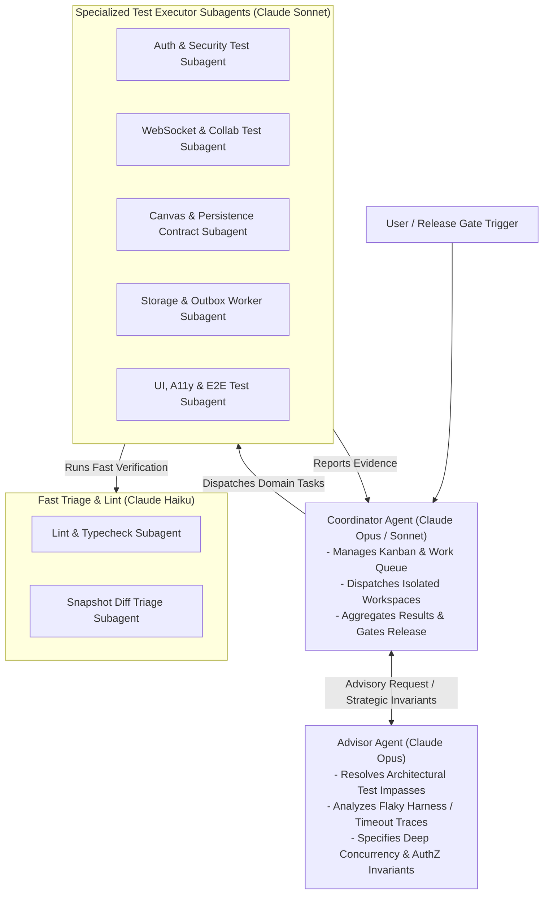
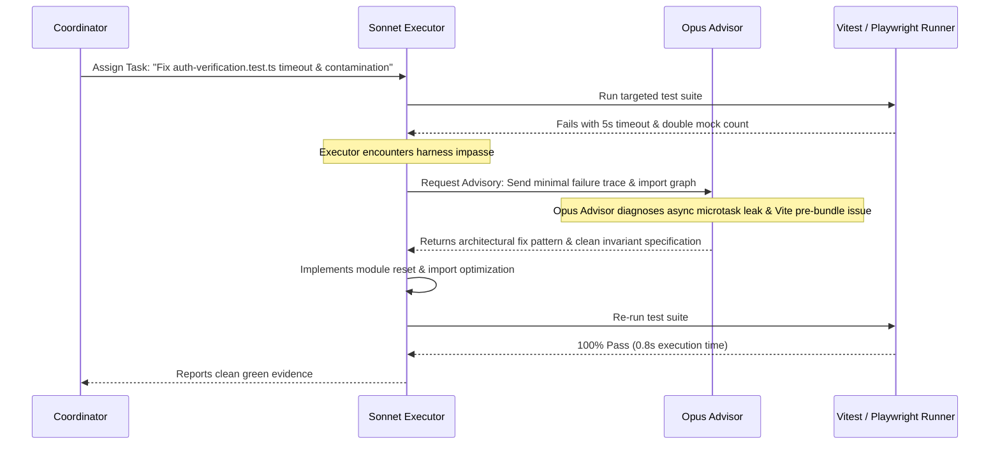

# 08 — Multi-Agent Test Orchestration & Execution Plan

This document defines the automated multi-agent testing orchestration architecture for Memoria, operationalizing the four Anthropic guidance frameworks:
1. **[Model Selection Taxonomy](https://claude.com/blog/claude-models-explained-choosing-the-best-model-for-your-use-case)**
2. **[Prompt Engineering Best Practices](https://platform.claude.com/docs/en/build-with-claude/prompt-engineering/claude-prompting-best-practices)**
3. **[Multi-Agent Orchestration](https://platform.claude.com/docs/en/managed-agents/multiagent-orchestration)**
4. **[The Advisor Strategy](https://claude.com/blog/the-advisor-strategy)**

---

## 1. Multi-Agent Architecture & Topology

To prevent context bloat, race conditions, and test workspace conflicts, test development is partitioned into a **Coordinator-Advisor-Subagent** model:



---

## 2. Model Selection & Workload Allocation Matrix

In compliance with Anthropic's [Model Selection Guide](https://claude.com/blog/claude-models-explained-choosing-the-best-model-for-your-use-case), each testing workload is matched to the optimal model tier:

| Model Tier | Cost Profile | Latency | Target Workload in Memoria Testing |
| --- | --- | --- | --- |
| **Claude Opus** *(Advisor / High Reasoning)* | Premium | Moderate | • Root-cause debugging of Vitest module resolution timeouts<br/>• Concurrency race hazard analysis (WebSockets, Locks, CAS)<br/>• Cryptographic token & session boundary audit<br/>• High-level test plan review and invariant formulation |
| **Claude Sonnet** *(Workhorse Executor)* | Balanced | Low-Moderate | • Writing Vitest unit and integration test files<br/>• Writing Playwright E2E and mobile specs<br/>• Authoring Zod response schema contract assertions<br/>• Implementing database test fixtures and mock services |
| **Claude Haiku / Fable** *(High-Throughput Triage)* | High Efficiency | Ultra-Low | • `pnpm lint`, `pnpm type-check`, `pnpm check-bundle` validation<br/>• Fast parsing of raw failure logs and stack traces<br/>• Visual screenshot diff categorization |

---

## 3. The Advisor-Executor Workflow

In alignment with [The Advisor Strategy](https://claude.com/blog/the-advisor-strategy), the system avoids wasting high-tier tokens on repetitive code generation while avoiding low-tier execution failures on complex architecture:



---

## 4. Claude Prompt Engineering Standards for Testing

All test generation tasks must follow Anthropic's [Prompt Engineering Best Practices](https://platform.claude.com/docs/en/build-with-claude/prompt-engineering/claude-prompting-best-practices) using explicit XML tags, unambiguous constraints, few-shot examples, and verification steps.

### Master Subagent Test Prompt Template

```xml
<test_generation_instruction>
  <role>
    You are an expert Test Engineer specializing in deterministic Next.js and TypeScript testing for Memoria.
  </role>

  <context>
    <architecture>
      Memoria is a stateful Next.js app with a custom WebSocket server (server.ts), PostgreSQL (Prisma),
      Redis (caching/lockout), and S3 storage. Durable authority is HTTP/Prisma; WebSockets are ephemeral.
    </architecture>
    <target_file>${TARGET_FILE}</target_file>
    <test_file>${TEST_FILE}</test_file>
  </context>

  <task>
    ${TASK_DESCRIPTION}
  </task>

  <constraints>
    <constraint>Do NOT modify production application code unless explicitly instructed.</constraint>
    <constraint>Do NOT use global sleep timeouts; use event listeners or waitFor.</constraint>
    <constraint>Always reset mock state using vi.resetModules() or explicit beforeEach cleanups.</constraint>
    <constraint>Ensure all tests run hermetically within the 5-second default timeout.</constraint>
  </constraints>

  <invariants>
    ${INVARIANTS_LIST}
  </invariants>

  <example>
    <input_case>Test that account lockout executes before password verification.</input_case>
    <expected_code>
      it("rejects locked accounts before checking password hash", async () => {
        mocks.isAccountLocked.mockResolvedValue(true);
        await expect(authorize(credentials)).rejects.toThrow(AccountLockedError);
        expect(mocks.argon2Verify).not.toHaveBeenCalled();
      });
    </expected_code>
  </example>

  <verification>
    Execute: pnpm test -- --run ${TEST_FILE}
    Confirm 0 failures, 0 timeouts, and zero unhandled rejections.
  </verification>
</test_generation_instruction>
```

---

## 5. Execution Roadmap & Phase Gates

```
Phase 1: Harness & Determinism Stabilization
├── Task 1.1: Pre-bundle App Router route dependencies in Vitest config.
├── Task 1.2: Fix async promise leak in auth-verification.test.ts.
└── Gate 1: pnpm test -- --run passes 100% reliably across all 59 test files.

Phase 2: Critical Logic & Contract Parity Tests
├── Task 2.1: Add unit tests for bounded response byte truncation & hasMore logic.
├── Task 2.2: Add contract parity tests between response-schemas.ts and frontend hooks.
└── Gate 2: Zero unchecked response shape divergences across canvas, dashboard, and share pages.

Phase 3: Security, Concurrency & Resilience Tests
├── Task 3.1: Add adversarial SSRF DNS-rebinding unit tests.
├── Task 3.2: Add WebSocket cursor storm stress test (60 msg/sec).
├── Task 3.3: Add outbox worker lease expiration and retry backoff tests.
└── Gate 3: Pass all adversarial security and concurrency invariant checks.

Phase 4: UI, Accessibility & Release Evidence Gate (IMP-038 / DEC-014)
├── Task 4.1: Register mobile viewport projects (320px, 375px) in Playwright.
├── Task 4.2: Integrate automated @axe-core/playwright accessibility audit suites.
├── Task 4.3: Execute full containerized release smoke test against Docker stack.
└── Gate 4: Complete green verification record for production promotion.
```
