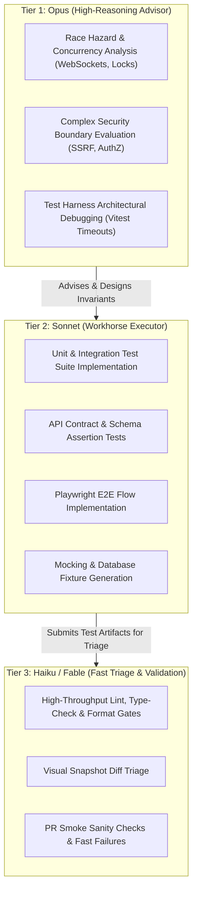

# Memoria Testing Gap Audit & Multi-Agent Test Strategy

This directory contains a comprehensive audit of all testing gaps across the Memoria codebase, paired with an actionable test implementation and multi-agent execution framework.

The audit and strategy directly integrate the architectural, prompt engineering, and agent orchestration patterns from Anthropic's official guidance:
- **[Model Selection Taxonomy](https://claude.com/blog/claude-models-explained-choosing-the-best-model-for-your-use-case)**: Optimal tiering across Opus (Deep Invariant & Concurrency Reasoning), Sonnet (Contract & Unit Code Execution), and Haiku (High-Throughput Triage & Validation).
- **[Prompt Engineering Best Practices](https://platform.claude.com/docs/en/build-with-claude/prompt-engineering/claude-prompting-best-practices)**: XML-tagged task contexts, unambiguous test invariants, few-shot assertion structures, and role-driven test specifications.
- **[Multi-Agent Orchestration](https://platform.claude.com/docs/en/managed-agents/multiagent-orchestration)**: Coordinator-to-subagent task delegation across isolated test domains with bounded contexts.
- **[The Advisor Strategy](https://claude.com/blog/the-advisor-strategy)**: Opus as an architectural Advisor diagnosing complex harness blockers and race hazards, pairing with Sonnet as an Executor for rapid, cost-efficient test authoring.

---

## Directory Index

| File | Domain / Focus | Key Risk Area | Primary Model Tier |
| --- | --- | --- | --- |
| **[01-auth-session-gaps.md](01-auth-session-gaps.md)** | AuthN, AuthZ, Sessions & Lockout | Account lockout ordering, account enumeration, session revocation | Sonnet (Exec) + Opus (AuthZ Advisor) |
| **[02-realtime-collaboration-gaps.md](02-realtime-collaboration-gaps.md)** | WebSockets & Ephemeral State | Cursor storm disconnects, Redis fanout drop, connection lifecycle | Opus (Advisor) + Sonnet (Exec) |
| **[03-canvas-persistence-contracts-gaps.md](03-canvas-persistence-contracts-gaps.md)** | Canvas CRUD, Bounded Responses & Contracts | Item truncation pagination bug (`hasMore`), missing runtime schemas | Sonnet (Exec) + Opus (Contract Advisor) |
| **[04-security-boundary-ssrf-gaps.md](04-security-boundary-ssrf-gaps.md)** | SSRF, CSP, Rate Limits & AI Ceilings | DNS rebinding TOCTOU, public share token leak, BYOK spend runaways | Opus (Security Advisor) + Sonnet (Exec) |
| **[05-storage-outbox-workers-gaps.md](05-storage-outbox-workers-gaps.md)** | S3 Uploads, Outbox & Background Jobs | Decompression bombs, outbox lease expiration mid-batch, thumbnails | Sonnet (Exec) |
| **[06-ui-accessibility-e2e-gaps.md](06-ui-accessibility-e2e-gaps.md)** | Playwright E2E, A11y & Mobile | Visual tests disabled in CI, 320px viewport overflow, ARIA landmarks | Sonnet (Exec) + Haiku (Snapshot Triage) |
| **[07-test-harness-performance-coverage-gaps.md](07-test-harness-performance-coverage-gaps.md)** | Vitest Harness, Timeouts & Coverage | Module import timeouts, mock contamination, 8% coverage floor | Opus (Harness Advisor) + Sonnet (Exec) |
| **[08-multiagent-orchestration-plan.md](08-multiagent-orchestration-plan.md)** | Orchestration Architecture & Prompts | Agent coordination workflows, Claude XML prompt templates | Opus (Coordinator) + Sonnet/Haiku |

---

## Executive Testing Gap Matrix

```
+----------------------------------------------------------------------------------------------------+
|                                    MEMORIA TESTING AUDIT MATRIX                                    |
+------------------------------------+----------+----------+-----------------------------------------+
| Test Category                      | Severity | Status   | Primary Gap Description                 |
+------------------------------------+----------+----------+-----------------------------------------+
| Auth & Lockout Ordering            | Critical | Missing  | Lockout checked after argon2 verify     |
| Bounded Response Byte Truncation   | Critical | Missing  | hasMore evaluated before byte budget    |
| Live WebSocket Cursor Continuity   | High     | Broken   | Continuous cursor broadcast stalls      |
| Response Schema Client Contracts   | High     | Missing  | Missing z.infer compile/runtime parity  |
| SSRF DNS Rebinding & Pinning       | High     | Weak     | TOCTOU window between DNS check & fetch |
| BYOK AI Endpoint Cost Guardrails   | High     | Missing  | Uncapped per-user token generation      |
| Playwright Visual & Mobile Matrix  | High     | Excluded | Visual specs ignored; no mobile viewports|
| Vitest Harness Timeouts & State    | High     | Flaky    | Dynamic route imports exceed 5s timeout |
| Global Coverage Thresholds         | Medium   | Weak     | 8% line threshold allows blind spots   |
| Outbox Lease Expiration & Poison   | Medium   | Untested | Concurrency lease handover mid-batch    |
| S3 Image Decompression Bombs       | Medium   | Untested | Image dimension/decompression validation|
| ARIA Live & Canvas Focus Traps     | Medium   | Partial  | Screen reader landmarks & shortcuts     |
+------------------------------------+----------+----------+-----------------------------------------+
```

---

## Model Selection & Economics Framework

In alignment with Anthropic's [Model Selection Guide](https://claude.com/blog/claude-models-explained-choosing-the-best-model-for-your-use-case), automated testing tasks are partitioned based on cognitive complexity, latency requirements, and compute cost:



1. **Claude Opus (Advisor)**:
   - **Cost Allocation**: ~15-20% of total tokens.
   - **Focus**: High-leverage architectural reasoning. Used to diagnose why `vitest` imports timeout, construct multi-client race condition invariants for WebSocket presence/cursors, verify cryptographic session boundaries, and design the contract schema mappings.
2. **Claude Sonnet (Executor)**:
   - **Cost Allocation**: ~70-75% of total tokens.
   - **Focus**: Authoring reliable, deterministic unit tests, API route test cases, mock implementations, and Playwright spec scripts.
3. **Claude Haiku / Fable (Triage)**:
   - **Cost Allocation**: ~5-10% of total tokens.
   - **Focus**: Running lightweight lint checks, analyzing raw test outputs, classifying failures, and parsing snapshot diffs.

---

## Key Strategic Principles for Memoria QA

1. **Stateful Authority Invariant**:
   - WebSockets are ephemeral signals; HTTP API + PostgreSQL + Prisma are the durable authority. Tests must assert that no ephemeral WebSocket message mutates `CanvasItem` rows directly without passing through HTTP/Prisma validation.
2. **Deterministic Hermetic Testing**:
   - Eliminate all global test timeouts by decoupling module imports from assertions.
   - Reset `vi.hoisted()` and `vi.mock()` states deterministically to prevent cross-test contamination.
3. **End-to-End Contract Verification**:
   - Zero tolerance for `any` at API client boundaries. Ensure every route response is tested against `src/lib/api/response-schemas.ts` and consumed via shared `z.infer<>` types.
4. **Adversarial Security First**:
   - Explicitly test failure paths: SSRF DNS rebinding, oversized payload rejection, expired token re-use, and rate-limit backoffs.
